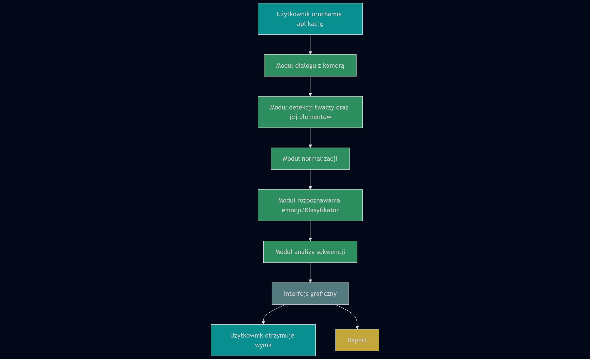

# Temat 2 Rozpoznawanie emocji ludzi na obrazie z kamery.

- Detekcja twarzy.
- Obsługa kamery.
- Zbadanie wpływu np. oświetlenia, elementów garderoby, koloru skóry na jakość rozpoznawania.
- Do wykorzystania m.in.: YOLO, OpenCV
- Zbiór danych:
  - https://www.kaggle.com/datasets/fatihkgg/affectnet-yolo-format

